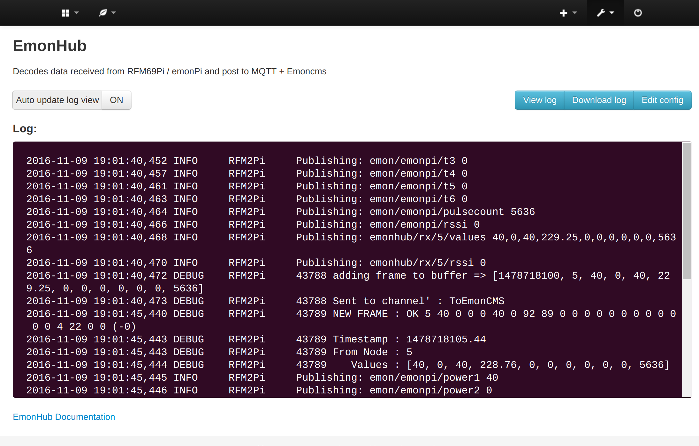

# emonHub Config Module

Emoncms emonhub.conf and emoncms configuration module for low-write raspberry pi based installations of emoncms

# Prerequisites

Emoncms, [Emonhub (emon-pi varient)](github.com/openenergymonitor/emonhub) should be installed

# Install

## Install module

    cd /var/www/emoncms/Modules
    git clone https://github.com/emoncms/config
    
Check for database updates in Emoncms admin

## Change permissions on emonhub.conf to allow web user to edit

    sudo chmod 666 /home/pi/data/emonhub.conf

