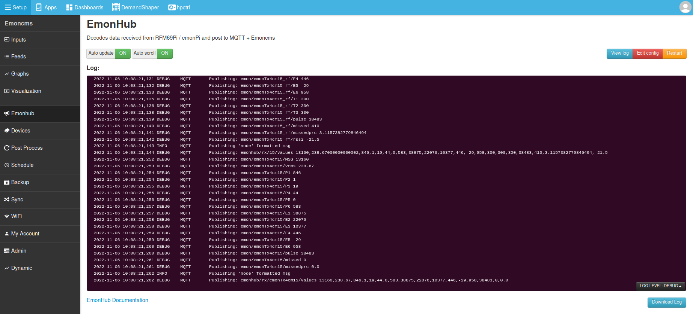

# emonHub Config Module

Configure emonhub.conf and view emonhub.log from within emoncms.



### Prerequisites

Emoncms, [Emonhub (emon-pi varient)](github.com/openenergymonitor/emonhub) should be installed

### Install

### Install module

    cd /var/www/emoncms/Modules
    git clone https://github.com/emoncms/config
    
### Change permissions on emonhub.conf to allow web user to edit

    sudo chmod 666 /home/pi/data/emonhub.conf

### Install sudoers entry to allow emonhub to be restarted

```
sudo cp emonhub-sudoers /etc/sudoers.d/
sudo chmod 0440 /etc/sudoers.d/emonhub-sudoers
```

## Give web user permission to read the emonhub systemd log

Emonhub service has now been [swtiched to using systemd](https://github.com/openenergymonitor/emonhub/blob/emon-pi/service/emonhub.service), to allow the emonhub config module to read the systemd log we need to add the following group permissions. 

`sudo usermod -a -G systemd-journal www-data`
